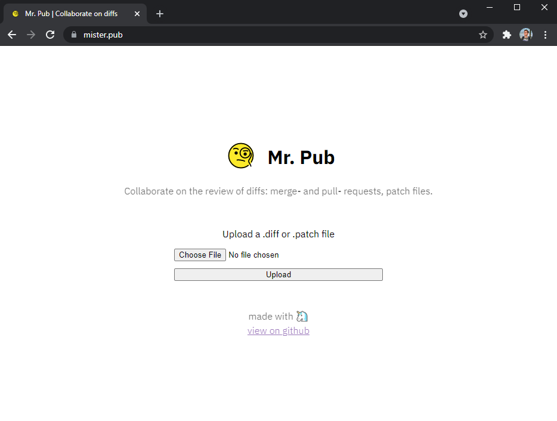
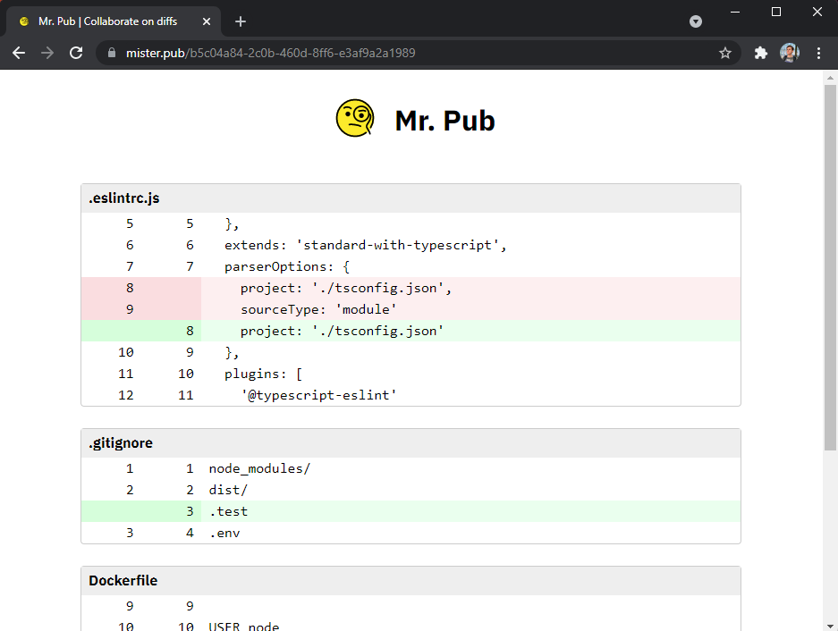

  

  <h2 align="center">Mister Pub</h2>

  

    
    
  

  

    Platform for developers to collaborate on diffs and patches when standard review tools 
    can't be used (e.g. when discussing changes with an external team)
     
    <a href="https://mister.pub/"><strong>Try it out »</strong></a>
     
     
    <a href="https://github.com/vpukhanov/mr-pub/issues">Report Bug</a>
    ·
    <a href="https://github.com/vpukhanov/mr-pub/issues">Request Feature</a>
  

